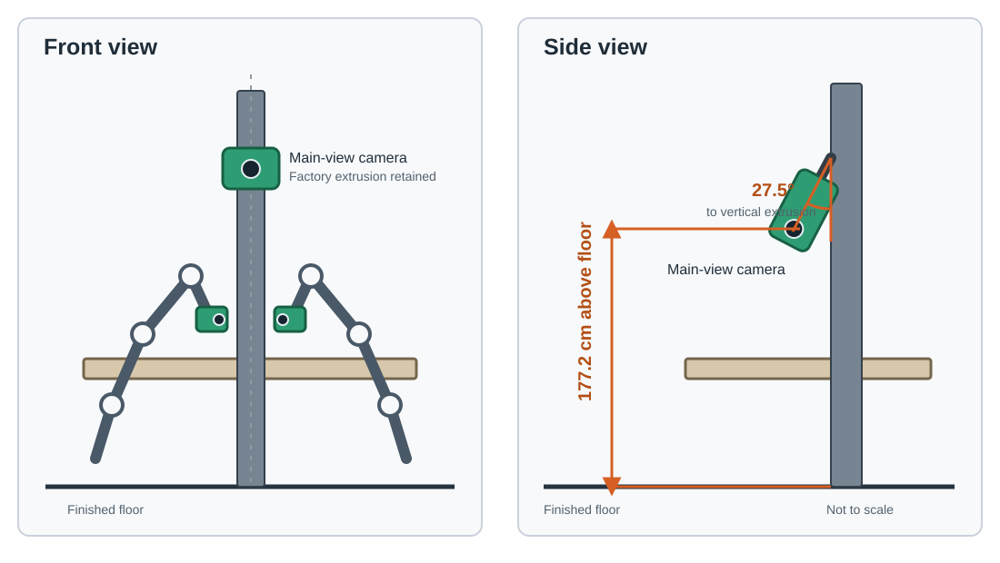

# DM0.5 真机机型改动说明

本文仅记录 OpenDM 所使用机型相对于原厂配置的改动。未列出的硬件、配件和安装方式均沿用原厂方案。

English version: [Physical Robot Modifications](../en/robot_platforms.md)

## AgileX COBOT Magic

基础机型：[AgileX COBOT Magic 官方页面](https://global.agilex.ai/products/cobot-magic)

在代码中对应的机型是 `Aloha`，其 `state_desc` 与 `RobotType.ALOHA_ROBOTWIN2` 相同：左臂 6 个关节、左夹爪、右臂 6 个关节、右夹爪，共 14 维。

相对于原厂配置，OpenDM 使用的设备有以下改动：

1. 左、右执行臂的臂上眼相机均更换为 [RealSense D405](https://www.realsenseai.com/products/stereo-depth-camera-d405/)。
2. D405 使用项目定制的长版相机支架，3D 文件见 [realsense-d405-wrist-camera-bracket-long.step](../../assets/embodiments/agilex_cobot_magic/realsense-d405-wrist-camera-bracket-long.step)。
3. 沿用原厂位于两条执行臂之间的铝型材主视角相机架，仅将相机安装高度调整为离地 `177.2 cm`。
4. 主视角相机与竖直铝型材之间的夹角调整为 `27.5°`。

图中的高度和夹角定义与实机标注照片一致；示意图不表达型材规格、支架结构或安装方法。

## Dexmal DOS-W1

基础机型：[Dexmal Mirror（DOS-W1）官方页面](https://dev.dexmal.com/product/dos-w1)

在代码中对应的机型是 `DOS W1`。

OpenDM 使用的设备沿用原厂相机及相机架设方案，仅调整主视角相机的位置：

1. 主视角相机安装高度调整为离地 `177.2 cm`。
2. 相机与竖直铝型材之间的夹角调整为 `27.5°`。

除以上两项外，其余配置均沿用原厂方案。
